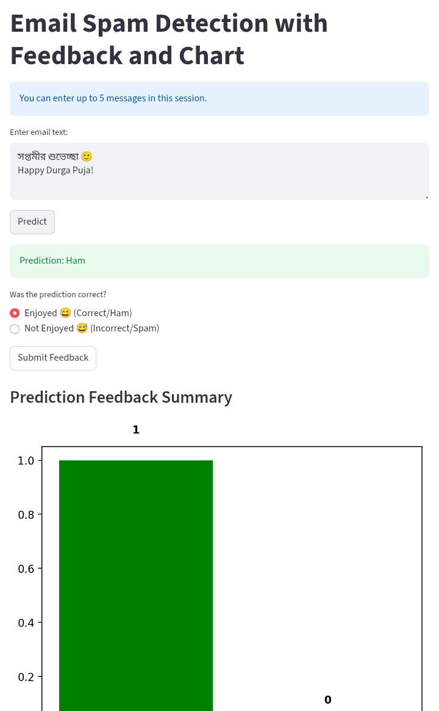

**Email Spam Detection with Feedback and Chart**

**Brief:**  
Python-based Email/Message Spam Detection code adopted for a fun interaction based simple game app.

# spam-ham-feedback-app
A Streamlit demo for Email/Message Spam Detection with feedback and charts.
Built with scikit-learn, Streamlit, matplotlib, and seaborn. 
Model: TF-IDF vectorizer + Multinomial Naive Bayes

## Repository Contents
- `spam_app_feedback.py` — Main script: trains model, evaluates metrics, and generates real time prediction vs feedback graph.  

## Requirements
- Python 3.8+  
- streamlit >=1.39.0
- scikit-learn
- matplotlib
- seaborn

## License / Usage
- This repository is for **viewing and academic reference only**.  
- You may **share** the code freely; citation is encouraged.  
- Citation format: [Repository URL] [accessed date].  
- You **may not modify** the code without written permission from the author.  
- Attribution to the original author is required.  
- The author is **not responsible** for any issues arising from use of the code.

## Notes
- This is for educational purposes, for experiencing how to deploy app on social media platform.
- Usage limit: Up to 5 messages per session
